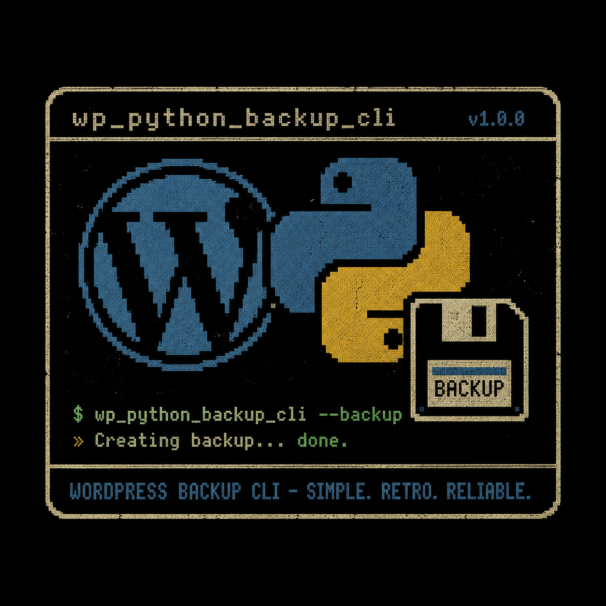

# Remote WordPress Backup Tool



- Uses Paramiko SSH module to connect to the remote machine via SSH.
- Uses SQLite3 to store site credentials (hostname, username, password/key, WP path, port).
- Stored passwords are encrypted at rest using Fernet symmetric encryption.
- Supports both **SSH key** and **password** authentication (key recommended).
- WP database backup requires **wp-cli** installed on the remote server for the connecting user.

> **Note:** `wp-content/uploads` is excluded from backups to reduce backup and restore times.
> Keep a separate backup of your uploads folder.

---

## Installation

### Option 1 — System packages via `apt` (Ubuntu/Debian)

Installs dependencies system-wide and keeps `./wp_backup.py` as the entry point:

```bash
make install        # installs deps + prompts for autocomplete setup
```

### Option 2 — Editable package install via `pip` (recommended for development)

Installs the project as a package and registers a `wp_backup` command available from anywhere:

```bash
make dev            # pip install -e . + prompts for autocomplete setup
```

After `make dev` you can call the tool as `wp_backup` instead of `./wp_backup.py`, and autocomplete
registration is simpler (no `./` prefix issue).

---

## Encryption Key

On first run, an encryption key is generated at `~/.wp_backup.key` (permissions: 600).
All passwords stored in the database are encrypted with this key.

> **Back up `~/.wp_backup.key`** — without it, stored passwords cannot be recovered.
> Never commit it to version control (it is already in `.gitignore`).

---

## Arguments

```
usage: WordPress Backup Tools [-h] [-u USER] [-p PASSWORD] [-k KEY] [-d DOMAIN]
                              [-P PATH] [-H HOST] [-i ID] [--port PORT]
                              [--trust-host]
                              [--action {backup,restore,add_website,
                                         delete_website,list_website,
                                         all_sites,check,
                                         backup_db,restore_db,list_website_db}]

options:
  -h, --help            show this help message and exit
  -u USER, --user USER  SSH username
  -p PASSWORD, --password PASSWORD
                        SSH password (use single quotes). Not required if using -k.
  -k KEY, --key KEY     Path to SSH private key file. Recommended over password auth.
  -d DOMAIN, --domain DOMAIN
                        Domain name
  -P PATH, --path PATH  WordPress installation path (no trailing slash)
  -H HOST, --host HOST  Hostname or IP
  -i ID, --id ID        Site ID — use with delete_website to delete by ID
  --port PORT           SSH port (default: 12345)
  --trust-host          Auto-accept unknown host keys (insecure, trusted networks only)
  --action              See actions below
```

> `-p` and `-k` can be combined — the password is then used as the passphrase for the key.

---

## Actions & Examples

### 1. Add a website to the database

With SSH key (recommended):

```bash
./wp_backup.py --action add_website -u SSH_USERNAME -k ~/.ssh/id_rsa -H IP/Hostname -d domain_name.com -P /home/user/domain_name.com --port 22
```

With password:

```bash
./wp_backup.py --action add_website -u SSH_USERNAME -p 'PASSWORD' -H IP/Hostname -d domain_name.com -P /home/user/domain_name.com --port 22
```

> Always wrap passwords in single quotes to prevent shell expansion.

---

### 2. Delete a website from the database

By domain name:

```bash
./wp_backup.py --action delete_website -d domain_name.com
```

By site ID (use `all_sites` to find the ID):

```bash
./wp_backup.py --action delete_website -i 3
```

---

### 3. List a specific site

```bash
./wp_backup.py --action list_website -d domain_name.com
```

Output:

```
OrderedDict([('wp_id', 3),
             ('domain_name', 'domain_name.com'),
             ('username', 'ssh_user'),
             ('password', 'SOME PASS'),
             ('hostname', '192.168.1.2'),
             ('wp_path', '/home/ssh_user/domain_name.com'),
             ('port', 22),
             ('ssh_key', '/home/user/.ssh/id_rsa')])
```

> `password` is shown decrypted. `ssh_key` is `None` if using password auth.

---

### 4. List all sites

```bash
./wp_backup.py --action all_sites
```

Output:

```
OrderedDict([('wp_id', 3),
             ('domain_name', 'domain_name.com'),
             ('username', 'ssh_user'),
             ('password', None),
             ('hostname', '192.168.1.2'),
             ('wp_path', '/home/ssh_user/domain_name.com'),
             ('port', 22),
             ('ssh_key', '/home/user/.ssh/id_rsa')])
```

---

### 5. Backup (credentials from CLI)

With SSH key:

```bash
./wp_backup.py --action backup -u SSH_USERNAME -k ~/.ssh/id_rsa -d domain_name.com -P /home/user/domain_name.com -H IP/Hostname
```

With password:

```bash
./wp_backup.py --action backup -u SSH_USERNAME -p 'PASSWORD' -d domain_name.com -P /home/user/domain_name.com -H IP/Hostname
```

---

### 6. Restore (credentials from CLI)

With SSH key:

```bash
./wp_backup.py --action restore -u SSH_USERNAME -k ~/.ssh/id_rsa -d domain_name.com -P /home/user/domain_name.com -H IP/Hostname
```

With password:

```bash
./wp_backup.py --action restore -u SSH_USERNAME -p 'PASSWORD' -d domain_name.com -P /home/user/domain_name.com -H IP/Hostname
```

---

### 7. Backup using stored database credentials

```bash
./wp_backup.py --action backup_db -d domain_name.com
```

---

### 8. Restore using stored database credentials

```bash
./wp_backup.py --action restore_db -d domain_name.com
```

---

### 9. List site details from the database

```bash
./wp_backup.py --action list_website_db -d domain_name.com
```

Output:

```
Domain:   domain_name.com
Username: ssh_user
Host:     192.168.1.2
Port:     22
WP Path:  /home/ssh_user/domain_name.com
SSH Key:  /home/user/.ssh/id_rsa
```

---

### 10. Check backup folder

Checks whether a backup folder exists on the remote server for today's date.

With SSH key:

```bash
./wp_backup.py --action check -u SSH_USERNAME -k ~/.ssh/id_rsa -d domain_name.com -P /home/user/domain_name.com -H IP/Hostname
```

---

## Manual Autocomplete Setup

If `make autocomplete` doesn't work for your environment, add this to `~/.bashrc`:

```bash
register-python-argcomplete wp_backup.py >> ~/.bashrc
complete -o nospace -o default -o bashdefault -F _python_argcomplete ./wp_backup.py >> ~/.bashrc
```

If installed via `make dev`, register the `wp_backup` command instead:

```bash
register-python-argcomplete wp_backup >> ~/.bashrc
```

> **Important:** Bash completion is tied to the **exact command string** you type.
> If you rename the script, move it to `$PATH`, or call it by full path, update the
> `complete` line to match. Using `make dev` avoids this entirely since `wp_backup`
> is a standard PATH command.

Or for global activation (handles any script name automatically):

```bash
sudo activate-global-python-argcomplete
```

### CentOS 7

```bash
curl -o /etc/yum.repos.d/CentOS-Base.repo https://el7.repo.almalinux.org/centos/CentOS-Base.repo
yum -y update
yum -y install python3-paramiko python3-argcomplete python3-cryptography
```

Reference: [AlmaLinux ELevate Guide](https://wiki.almalinux.org/elevate/ELevating-CentOS7-to-AlmaLinux-9.html)
